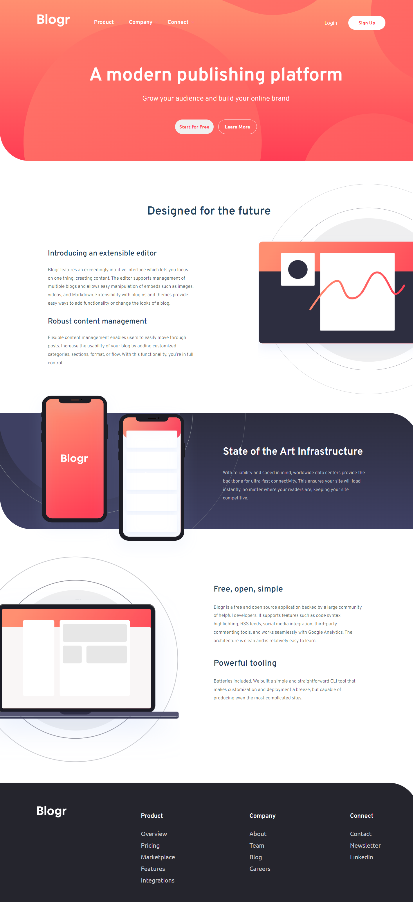

# Blogr landing page solution

[Blogr landing page](https://www.frontendmentor.io/challenges/blogr-landing-page-EX2RLAApP). 

## Table of contents

- [Overview](#overview)
  - [The challenge](#the-challenge)
  - [Screenshot](#screenshot)
- [My process](#my-process)
  - [Built with](#built-with)
- [Author](#author)

## Overview

### The challenge

Users should be able to:

- View the optimal layout for the site depending on their device's screen size
- See hover states for all interactive elements on the page

### Screenshot

- Mobile

- Laptop

## My process

- Plan the navigation and structure to ensure a smooth user experience.
- Code the HTML structure based on the wireframe, incorporating responsive design for various devices.
- Apply CSS styles to enhance the visual presentation and ensure consistency.
- Implement interactive elements, like hover effects, and buttons, to enhance user engagement.
- Optimize images and code for faster loading times.
- Ensure cross-browser compatibility and responsiveness across different devices.
- Conduct thorough testing of the landing page on various browsers and devices to identify and fix any issues.
- Test interactive elements to ensure a seamless user experience.
- Optimize the landing page for search engines.
- Deploy the Blogr landing page on the desired web hosting platform.
- Monitor performance post-launch and address any issues that may arise.

### Built with

- Semantic HTML5 markup
- CSS custom properties
- Flexbox
- CSS Grid
- Mobile-first workflow
- Javascript
- jQuery

## Author

- Website - [Github](https://github.com/amrmabdelazeem)
- Frontend Mentor - [@amrmabdelazeem](https://www.frontendmentor.io/profile/amrmabdelazeem)